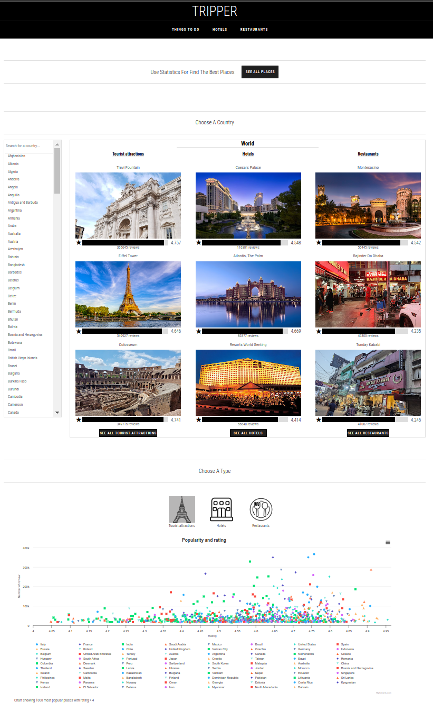

<!-- PROJECT LOGO -->
 

  

  <h3 align="center">TRIPPER</h3>

  

    A project that helps you choose places to travel
  

<!-- TABLE OF CONTENTS -->

  
Table of Contents

  <ol>
    <li>
      <a href="#about-the-project">About The Project</a>
      <ul>
        <li><a href="#built-with">Built With</a></li>
      </ul>
    </li>
    <li><a href="#usage">Usage</a></li>
    <li><a href="#contact">Contact</a></li>
  </ol>

<!-- ABOUT THE PROJECT -->
## About The Project

I really love independent travel! And when planning each trip, I am faced with the need to choose the places I want to visit. But how to choose the best and not make a mistake? And how can you avoid spending too much time on it?
After spending a lot of time studying various sites and maps for travelers, I came to the conclusion that the most places with the largest number of reviews for them are stored on Google maps. But using them for planning and choosing places to visit is not convenient.
Therefore, I created this site to help me with the choice and at the same time I do not have to spend a lot of time studying Google maps.

Here's why:
* All information for selection is presented on the graph
* No need to waste time, the best is already before your eyes
* You can also use this to select hotels and restaurants
* You won't miss anything worth visiting:smile:

### Built With

This section should list any major frameworks/libraries used to bootstrap your project. Leave any add-ons/plugins for the acknowledgements section. Here are a few examples.

* [![Python][Python]][Python-url]
* [![Django][Django]][Django-url]
* [![DRF][DRF]][DRF-url]
* [![Javascript][Javascript]][Javascript-url]
* [![Highcharts][Highcharts]][Highcharts-url]

(<a href="#readme-top">back to top</a>)

<!-- USAGE EXAMPLES -->
## Usage

Just select a country and look at the graph. All the most interesting things are located in the upper right part of the graph.

<!-- CONTACT -->
## Contact

Kirill Gorbunov kirgorbunov@gmail.com

Project Link: [https://github.com/KirGorbunov/tripper](https://github.com/KirGorbunov/tripper)

(<a href="#readme-top">back to top</a>)

<!-- MARKDOWN LINKS -->

[Python]: https://img.shields.io/badge/python-3670A0?style=for-the-badge&logo=python&logoColor=ffdd54
[Python-url]: https://www.python.org/
[Django]: https://img.shields.io/badge/django-0C4B33?style=for-the-badge&logo=django&logoColor=F1FFF7
[Django-url]: https://www.djangoproject.com/
[DRF]: https://img.shields.io/badge/drf-2C2C2C?style=for-the-badge&logo=django&logoColor=F1FFF7
[DRF-url]: https://www.django-rest-framework.org/
[Javascript]: https://img.shields.io/badge/javascript-2C2C2C?style=for-the-badge&logo=javascript&logoColor=F1FFF7
[Javascript-url]: https://www.javascript.com/
[Highcharts]: https://img.shields.io/badge/highcharts-2f2b38?style=for-the-badge&logo=highcharts&logoColor=FFFFFF
[Highcharts-url]: https://www.highcharts.com/
